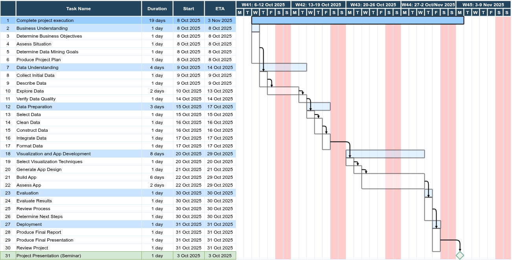

---

# Phase: Business Understanding

## Task: Determine Business Objectives

### Output: Background

You have been hired as a Data Analyst for *Mythic Realm Studios*, a fictitious gaming company known for numerous worldwide hits.

### Output: Business Objectives

Senior Leadership at *Mythic Realm Studios* wants more visibility into the gaming industry, so they can determine which games and markets are most promising.

You have been asked to produce an interactive dashboard (using Plotly and Dash) that enables the leadership team to explore things like the most popular genres, titles, platforms, and more.

Sample queries Senior Leadership want answers to via the Dash application:
- Which regions (north america, japan, europe and africa, other) prefer which platform the most for playing video games?
- What is the most popular platform for playing video games?
- How do video game sales vary per release year in each region (north america, japan, europe and africa, other)?
- Which platforms for playing video games have been the most popular each release year?
- Which regions prefer which genre the most?
- What are the top three genres per region?
- Which genres have been more or less popular with the passing of time?
- Which publishers have consistent success and which publishers are hit or miss with games?
- Which region (north america, japan, europe and africa, other) purchases the most video games?
- Which titles sold the most worldwide?
- Which release year had the highest sales, and is the industry growing over time?
- Do any platforms seem to specialize in a particular genre?
- What titles are popular in one region (north america, japan, europe and africa, other) but flop in another?

### Output: Business Success Criteria

In this project, Patrick G. has been identified as the person within the company that will subjectively assess if the business success criteria have been fulfilled. But, basically, if all the business objectives have been met, the business success criteria will have been fulfilled.

## Task: Assess Situation

### Output: Inventory of Resources

- Human Resources
  - The human resources consist of the members in each group, including Patrick G. who is available to answer technical and business-related questions via sceduled tutoring sessions.
- Hardware Resources
  - Student laptops.
  - University PCs (optional).
- Software Resources
  - Environment setup
    - The development environment consists of:
      - Operating System (any of: Linux distro., MacOS, Windows).
      - Visual Studio Code (VSCode).
      - Python, with virtual Environments via Miniconda.
      - Jupyter Notebooks.
      - Google CoLab (optional).
      - Git and GitHub (optional).
  - Usable Data Format
    - The datasets consist of CSV (Comma Separated Value) files, and optionally Pandas DataFrames stored in the Pickle (.pkl) format.
  - Import Libraries
    - At least the following Python packages will be required:
      - ipykernel, jupyter, pylance
      - numpy, pandas
      - plotly (optionally matplotlib and seaborn)
      - dash, dash-bootstrap-components
      - openpyxl, lxml, pycountry
  - Computable Data
    - The main data structures consist of Numpy Arrays and Pandas DataFrames.
- Techniques
    - This project includes various visualization techniques (e.g. line plots, scatter plots, bar plots, distribution plots, choropleth plots).
    - This project does **not** include any traditional data mining or machine learning (so no data mining or machine learning techniques).

### Output: Requirements, Assumptions and Constraints

- Project Requirements
  - The schedule for the project can be found on [Kronox](https://schema.hb.se/setup/jsp/Schema.jsp?startDatum=2025-09-01&intervallTyp=a&intervallAntal=1&sprak=SV&sokMedAND=true&forklaringar=true&resurser=k.C1VI1B-20252-I22H5-) or via the [Project Plan](#output-project-plan).
  - The results should be comprehensible and of such a quality that Senior Leadership are able to use the Dash application to answer any questions listed in the Business Objectives.
  - Security and Legal Issues are out-of-scope for this project.
- Project Assumptions
  - With regards to the data, the acquired  and pre-processed datasets are assumed to contain all information relevant to meeting the Business Objectives and Data Mining Objectives.
- Project Constraints
  - All resources (human, hardware, software) will be available during the wntire lifetime of the project without any specific constraints.
  - No technological constraints with regards to the datasets have been identified.

### Output: Risks and Contingencies

Identified risks that might affect the project, with corresponding contingency plans, include:
- Non-optimal project planning.
  - Remedied by revisiting the project planning.
- Non-optimal group dynamcis within project groups.
  - Remedied by reallocating group members between groups during the beginning of the project, otherwise by discussing solutions during the tutoring sessions.
- Sickness of other unforeseen absence during the project.
  - Since the project groups are relatively large, this shouldn't be a problem unless it affects multiple groups members simultaneously (in that case, remedies will be discussed during the tutoring sessions).
- Hardware and/or software issues.
  - Remedied by using Google CoLab as a plan B.
  

### Output: Terminology

The glossary of terminology relevant to the project members is a dynamic document that will grow as the project members add common terminology.

**Glossary of relevant business terminology**

| Term           | Description |
| -------------- | ----------- |
| Game | A specific video game title (e.g., Super Mario Bros., Call of Duty). Each row in the dataset usually represents one game. |
| Platform | The hardware or system a game is released on (e.g., PlayStation 4, Xbox One, Nintendo Switch, PC). Some games are released on multiple platforms. |
| Genre | A category that describes the style of gameplay (e.g., Action, Sports, Role-Playing, Puzzle). Genres group games with similar mechanics or themes. |
| Game Developer | The company or team that creates the game. They design, code, and build it (e.g., Naughty Dog, FromSoftware). |
| Game Publisher | The company that markets, distributes, and finances the game. They often handle advertising, production, and sales (e.g., Electronic Arts, Nintendo, Activision). Sometimes the publisher and developer are the same. |
| Region | Geographic market where video games are sold, e.g. North America (mainly USA & Canada), Europe, Japan, Other (all other regions combined), Total/Global/WorldWide (total worldwide regions, i.e. all regions). |
| Sales | The number of physical game copies sold (usually reported in millions of units). Regional sales show performance in specific markets, while global sales show overall popularity. |

**Glossary of relevant technical terminology**

| Term | Description |
| ---- | ----------- |
| Axis/Axes| The horizontal (x) and vertical (y) lines used to measure and display data in a chart. |
| Bar Chart | A chart with rectangular bars whose lengths represent values.
| Line Chart | A chart connecting points with lines, often used for trends over time. |
| Scatter Plot | A plot using dots to show relationships between two variables. |
| Histogram | A bar chart representing the distribution of numerical data. |
| Choropleth Map | A map where regions are colored based on a numerical value (e.g., sales per country). |
| Bubble Chart | A scatter plot where the size of the marker represents a third variable. |
| Tooltip/Hover Text | Text that appears when you hover over a chart element to show additional information. |
| Legend | A key explaining the meaning of colors, symbols, or line types in a chart. |
| Filter/Slicer | A control that allows the user to focus on a subset of data.
| Trace | A single series of data in a Plotly figure (e.g., one line in a line chart, one set of bars in a bar chart). |
| Figure | The complete Plotly chart, which can contain multiple traces, layout settings, and annotations. |
| Layout | The configuration of a Plotly figure including titles, axes, and margins. |
| Barmode | How bars are displayed in a grouped bar chart (group, stack, or overlay). |
| Marker | Visual styling for points in a scatter or bubble chart (size, color, symbol). |
| Hovertemplate | Custom formatting for hover text in Plotly charts. |
| Animation Frame | In Plotly, a way to create an animated chart by iterating over a variable (e.g., time). |
| App | A Dash application consisting of a layout and callback functions. |
| Layout | The structure of the Dash app, including components like graphs, dropdowns, sliders, and text. |
| Callback | A Python function in Dash that updates components dynamically based on user input. |
| Input | A Dash component whose value triggers a callback function. |
| Output | A Dash component that is updated as a result of a callback. |
| State | Optional component values passed to a callback that do not trigger it. |
| dcc.Graph | Dash component for embedding Plotly figures. |
| dcc.Dropdown/dcc.Slider/dcc.Checklist |  Interactive controls for filtering or selecting data. |
| html.Div/html.H1/html.P | Basic HTML components for layout in Dash. |

### Output: Costs and Benefits

Here we would usually construct a cost-benefit analysis, i.e. project costs vs. business benefits, so that we can decide if it's worth persuing this project or not (in this case, we can assume we want to go forward with the project).

## Task: Determine Data Mining Goals

### Output: Data Mining Goals

Since we aren't conducting any traditional data mining or machine learning in this project, our *data mining goals* are more related to how we want to structure and visualize our data, and how we want to design our Dash application.

To make this a bit easier in this project, we will express the *data mining goals* similar to the *business objectives* (which is **not** the case in a *real* data mining/machine learning project).

We want to design our Dash application, such that it can be used to explore and understand the data using various visualizations, in order to answer the following questions:
- Which regions (north america, japan, europe and africa, other) prefer which platform the most for playing video games?
- What is the most popular platform for playing video games?
- How do video game sales vary per release year in each region (north america, japan, europe and africa, other)?
- Which platforms for playing video games have been the most popular each release year?
- Which regions prefer which genre the most?
- What are the top three genres per region?
- Which genres have been more or less popular with the passing of time?
- Which publishers have consistent success and which publishers are hit or miss with games?
- Which region (north america, japan, europe and africa, other) purchases the most video games?
- Which titles sold the most worldwide?
- Which release year had the highest sales, and is the industry growing over time?
- Do any platforms seem to specialize in a particular genre?
- What titles are popular in one region (north america, japan, europe and africa, other) but flop in another?

### Output: Data Mining Success Criteria

In this project, Patrick G. has been identified as the person within the company that will subjectively assess if the *data mining success criteria* have been fulfilled. But, basically, if all the *data mining goals* have been met, the *data mining success criteria* will have been fulfilled.

## Task: Produce Project Plan

### Output: Project Plan

The project plan should, at a minimum, list project stages, with durations, resources required, inputs, outputs, and dependencies. The project plan is a dynamic document, updated at the end of each phase. An initial project plan (without any human resource allocations) is provided below to get you going. Discuss your project plan within your project group, and adjust it accordingly. You can use any tool you like (e.g. MS Project, Excel). Note, I have used a *waterfall* approach in the sample project plan, but an iterative and incremental approach can also be used (more akin to SCRUM), since CRISP-DM is really an iterative process.

</img>

**Note**

I created the sample project plan like this:
- Install the [Draw.io Integration](https://marketplace.visualstudio.com/items?itemName=hediet.vscode-drawio) VSCode Extension.
- Create a file with the extension `.drawio.png` (in my sample, the file is called `project_plan.drawio.png` and is located in folder `project/reports/images`).
- Open the file in VSCode (which will open the Draw.IO design surface in the Code Editor).
- Now you can create any Draw.IO drawing you want, but I used the following steps:
  - From the Draw.IO main menu, choose `File -> Arrage -> Insert -> Template`.
  - In the left margin, choose `Tables`.
  - Select the `Gantt 1` template and click the `Insert`  button.
  - Restructure the Gantt chart (table) as desired using the Draw.IO tools (and save the file).
  - In any markdown file (i.e. `.md` file such as this file) or Jupyter Notebook markdown cell, you can then display the `.png` image with the following code (using a HTML `img` tag for displaying an image, where `src` is the path to the image):

    ```html
    Project Plan</img>
    ```

### Output: Initial Assessment of Tools and Techniques

Decide if any tools or techniques need to be changed here (or just accept the provided defaults above).